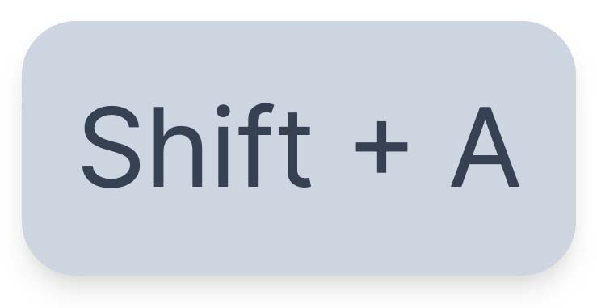

# ScreenKeys
This library provides a visual way to display on screen key presses for web demonstrations and recordings.

The keys disappear after half a second by defaulf but it can be costumized.

## Live Demo
ScreenKeys Live Website:

<a href="https://adir-sl.github.io/ScreenKeys">ScreenKeys</a>

And a working demo of this library:

<a href="https://codepen.io/Adir-SL/pen/poaXYzK">Codepen ScreenKeys Demo</a>

## How to use
Installation is very simple, just link to the "keys.js" file from this repo.

like so:
```HTML
<script src="keys.js"></script>
```

You can also link it directly to GitHub like so:
```HTML
<script src="https://adir-sl.github.io/ScreenKeys/keys.js"></script>
```

Then you can call this function:
```Javascript
initKeys();
```
This function can be customized with the parameters mentioned below.

But it also has some sensible defaults so you don't have to, as mentioned in the "Default parameters" section.

## Customizations
This includes a few built-in variables to customize your experience:
1. size referes to the font-size in px (e.g 10, 16, 24);
2. posx is the position in the x axis, can be 'left', 'right' or 'center';
3. posy is the position in the y axis, can be 'top', 'bottom' or 'center';
4. delay refers to the time (in milliseconds) it takes for the toast to disappear (e.g "500", "1000", "1500");
5. bg is the color of the background of the keys (CSS background-color);
6. txt is the color of the text of the keys (CSS color);

## Default parameters
```Javascript
initKeys(16, 'center', 'bottom', '500', '#cbd5e1', '#334155');
```
1. font-size: 16px
2. position on x: center
3. position on x: left
4. 500ms delay before it disappears
5. background-color: #cbd5e1
6. color: #334155 (text color)